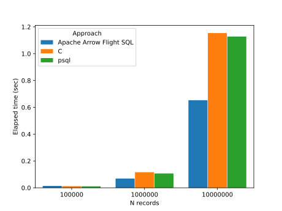

<!--
  Licensed to the Apache Software Foundation (ASF) under one
  or more contributor license agreements.  See the NOTICE file
  distributed with this work for additional information
  regarding copyright ownership.  The ASF licenses this file
  to you under the Apache License, Version 2.0 (the
  "License"); you may not use this file except in compliance
  with the License.  You may obtain a copy of the License at

    http://www.apache.org/licenses/LICENSE-2.0

  Unless required by applicable law or agreed to in writing,
  software distributed under the License is distributed on an
  "AS IS" BASIS, WITHOUT WARRANTIES OR CONDITIONS OF ANY
  KIND, either express or implied.  See the License for the
  specific language governing permissions and limitations
  under the License.
-->

# Benchmark - only with integer data

## How to run

Install Apache Arrow Flight SQL PostgreSQL adapter.

Run PostgreSQL with the following configuration:

```text
shared_preload_libraries = 'arrow_flight_sql'
```

Prepare database:

```bash
psql postgres -c '\i benchmark/integer/prepare-1M.sql'
```

It creates `afs_benchmark` database and `data` table in the database.
It also inserts 10M records with random integers to the table.

Run the following programs:

- `select.rb`: It uses Apache Arrow Flight SQL
- `select`: It uses PostgreSQL's C API
- `select.sql`: You need to use `psql` to run this

All of them just run `SELECT * FROM data`.

## Result

Here is a benchmark result on the following environment:

- OS: Debian GNU/Linux sid
- CPU: AMD Ryzen 9 3900X 12-Core Processor
- Memory: 64GiB
- PostgreSQL: 16 (not released yet)
  019f8624664dbf1e25e2bd721c7e99822812d109
- Apache Arrow: 12.0.0-SNAPSHOT
  237705bf17486cfc35ab7d1ddfe59dd60f042ab8
- Apache Arrow Flight SQL PostgreSQL adapter:
  0.1.0 (not released yet)
  120e7bbd3fd580c892c988499d488c7e8b34efe2



100K records:

| Apache Arrow Flight SQL | C     | psql  |
| ----------------------- | ----- | ----- |
| 0.014                   | 0.012 | 0.011 |

1M records:

| Apache Arrow Flight SQL | C     | psql  |
| ----------------------- | ----- | ----- |
| 0.069                   | 0.116 | 0.107 |

10M records:

| Apache Arrow Flight SQL | C     | psql  |
| ----------------------- | ----- | ----- |
| 0.653                   | 1.154 | 1.128 |
