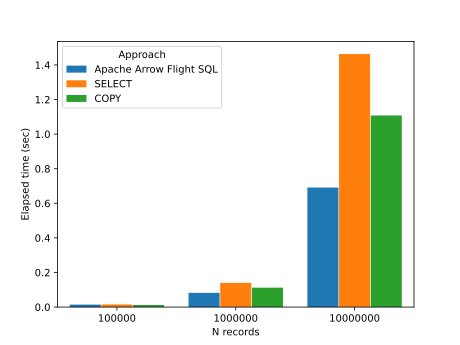
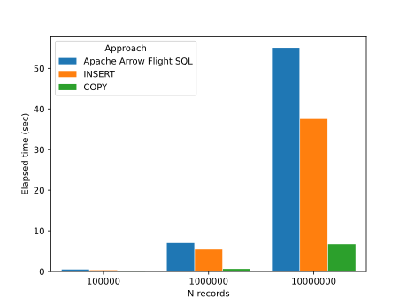

<!--
  Licensed to the Apache Software Foundation (ASF) under one
  or more contributor license agreements.  See the NOTICE file
  distributed with this work for additional information
  regarding copyright ownership.  The ASF licenses this file
  to you under the Apache License, Version 2.0 (the
  "License"); you may not use this file except in compliance
  with the License.  You may obtain a copy of the License at

    http://www.apache.org/licenses/LICENSE-2.0

  Unless required by applicable law or agreed to in writing,
  software distributed under the License is distributed on an
  "AS IS" BASIS, WITHOUT WARRANTIES OR CONDITIONS OF ANY
  KIND, either express or implied.  See the License for the
  specific language governing permissions and limitations
  under the License.
-->

# Benchmark - only with integer data

## How to run

See the [README.md in the parent directory](../README.md).

## Environment

Here is a benchmark result on the following environment:

- OS: Debian GNU/Linux sid
- CPU: AMD Ryzen 9 3900X 12-Core Processor
- Memory: 64GiB
- PostgreSQL: 17 (not released yet)
  5d8aa8bcedae7376bd97e79052d606db4e4f8dd4
- Apache Arrow: 15.0.0-SNAPSHOT
  e62ec62e40b04b0bfce76d58369845d3aa96a419
- Apache Arrow Flight SQL PostgreSQL adapter:
  0.2.0 (not released yet)
  14df9b5fe61eda2d71bdfbf67c61a227741f616c

## Results

### `SELECT`

100K records:

| Apache Arrow Flight SQL | `SELECT` | `COPY` |
| ----------------------- | -------- | ------ |
| 0.014                   | 0.015    | 0.012  |

1M records:

| Apache Arrow Flight SQL | `SELECT` | `COPY` |
| ----------------------- | -------- | ------ |
| 0.082                   | 0.140    | 0.112  |

10M records:

| Apache Arrow Flight SQL | `SELECT` | `COPY` |
| ----------------------- | -------- | ------ |
| 0.691                   | 1.463    | 1.108  |

### `INSERT`

100K records:

| Apache Arrow Flight SQL | `INSERT` | `COPY` |
| ----------------------- | -------- | ------ |
| 0.497                   | 0.310    | 0.068  |

1M records:

| Apache Arrow Flight SQL | `INSERT` | `COPY` |
| ----------------------- | -------- | ------ |
| 7.013                   | 5.410    | 0.637  |

10M records:

| Apache Arrow Flight SQL | `INSERT` | `COPY` |
| ----------------------- | -------- | ------ |
| 55.064                  | 37.522   | 6.720  |
